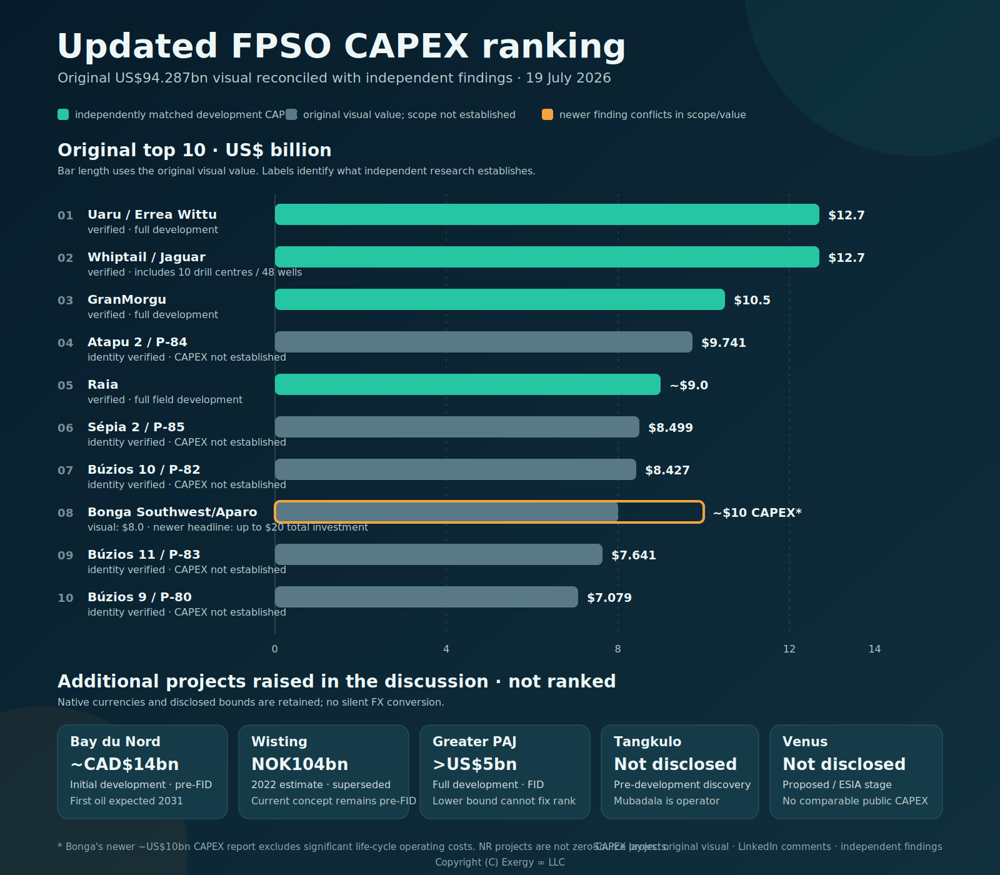

# Top 10 FPSO projects by CAPEX

This case study starts with Giacomo Prandelli's LinkedIn post, [“$94 billion — That's what the top 10 FPSO projects to 2030 are worth”](https://www.linkedin.com/posts/prandelligiacomo_94-billion-thats-what-the-top-10-fpso-activity-7482020247210815488-DdkV). The post and its accompanying top-10 CAPEX visual are the trigger for exploring where the next wave of deepwater investment is concentrated and what that concentration could mean for the offshore supply chain.

## The trigger

The visual makes a striking geographic argument: nine of the ten highest-CAPEX FPSO projects shown are in the South Atlantic. Brazil, Guyana, and Suriname dominate the ranking; Nigeria's Bonga Southwest/Aparo is the only entry outside that region.

The post highlights several features of the ranking:

- The ten projects represent approximately **$94 billion** in combined CAPEX through 2030.
- ExxonMobil's **Uaru** and **Whiptail** projects in Guyana occupy the top two positions, each shown at **$12.7 billion**.
- Petrobras accounts for five entries: **Atapu, Sépia, Búzios X, Búzios XI, and Búzios IX (Franco)**.
- The ranking presents the South Atlantic—especially Brazil's pre-salt and Guyana's Stabroek Block—as the center of near-term large-scale FPSO investment.

## The visual

*The local source visual ranks ten upcoming FPSO projects by stated value, operator, stage, and country.*

The original top-10 FPSO CAPEX visual is included in the [LinkedIn post](https://www.linkedin.com/posts/prandelligiacomo_94-billion-thats-what-the-top-10-fpso-activity-7482020247210815488-DdkV). It ranks the projects by stated capital value and makes the regional concentration immediately visible: the two Guyana projects lead, Petrobras supplies half of the list, and only one project falls outside the South Atlantic grouping.

The visual is useful as a starting point because it turns a collection of individual developments into a portfolio-level signal. The important observation is not only the size of any one FPSO, but the clustering of capital, operators, engineering demand, and long-lived production infrastructure in a small number of offshore basins.

## Questions for the case study

This repository can develop the visual into a traceable industry perspective by asking:

- Which cost definition does each CAPEX estimate use—FPSO contract value, full field development, or another basis?
- What are the project status, expected final investment decision, first-oil date, production capacity, and contracting model?
- How sensitive is the ranking to schedule changes, cost escalation, and project scope?
- Which operators, contractors, yards, and technology suppliers are most exposed to this investment cycle?
- What demand does the concentration create for subsea systems, topsides, mooring, power, automation, connectivity, cybersecurity, reliability, and lifecycle support?

## Source and interpretation

The LinkedIn post and visual are the **trigger source**, not a complete project-cost dataset. Names, rankings, values, and the $94 billion total should be treated as attributed claims until checked against operator disclosures, contract announcements, regulatory filings, and other primary sources. Any derived dataset or updated visual added here should record its source, date, CAPEX definition, currency basis, and confidence level.

### Data provenance layout

The source layers are deliberately stored in separate files:

- [`original_post.json`](./xframe/data/original_post.json) contains only the ranking and ten project rows transcribed from the original post and visual.
- [`comment_additions.json`](./xframe/data/comment_additions.json) contains the attributed LinkedIn comments and their proposed project mentions.
- [`independent_findings.json`](./xframe/data/independent_findings.json) contains independent sources and the direct or inferred findings derived from them.
- [`reference_data.json`](./xframe/data/reference_data.json) contains shared countries, operators, and contractors referenced across the three provenance layers.

Independent findings qualify the source claims without rewriting them. For example, the original visual remains preserved as published even where independent research indicates a broader development-level CAPEX scope, an ambiguous project-to-FPSO mapping, or a different operator/contractor role.

### An important question from the discussion

[Luciano Jorge de Carvalho Junior](https://www.linkedin.com/in/luciano-jorge-de-carvalho-junior-349bb530) asked in a comment:

> Those values are including which investments, besides the FPSOs per se?

That question is central to interpreting the ranking. The visual labels the numbers as project values, but does not define their cost boundary. A value could refer to the FPSO contract or vessel scope alone, or it could include drilling, subsea production systems, SURF, installation, host modifications, and other elements of full field development. Comparing values without a common scope can produce a precise-looking but misleading ranking.

The model therefore records the ranking's `capex_scope` as `unknown` and its `capex_scope_status` as `unresolved`. The comment is retained as a `source_comment`, distinctly sourced from the original post and visual, with an open `capex_scope` issue. Until project-level primary sources establish a consistent basis, this case study describes the numbers as **stated project values**, not FPSO-only CAPEX.

## Updated ranking and CAPEX reconciliation

The expanded table keeps the visual's order but adds the projects proposed in the comments. It does **not** assign new ordinal ranks to estimates in CAD or NOK, or to projects without a disclosed estimate: doing so would require an exchange-rate date and a common cost boundary. “Verified” means the amount and its development scope are supported by the linked independent source; it does not mean that the amount is FPSO-only.

*The original USD ranking is shown on a common axis. Comment additions remain unranked and retain their disclosed native currencies and evidence status.*

| Original rank | Project | Origin | Published CAPEX | Independent CAPEX finding | Cost boundary and ranking treatment |
| ---: | --- | --- | ---: | ---: | --- |
| 1 | Uaru / Errea Wittu | Original visual | US$12.7bn | **US$12.7bn verified** | Whole Uaru development, including its FPSO; retain at 1 on the visual's basis. |
| 2 | Whiptail / Jaguar | Original visual | US$12.7bn | **US$12.7bn verified** | Whole development: up to 10 drill centres and 48 production/injection wells, not FPSO-only; retain at 2 (tie) on the visual's basis. |
| 3 | GranMorgu | Original visual | US$10.5bn | **US$10.5bn verified** | Total development investment, including a 220,000 bpd FPSO; retain at 3. |
| 4 | Atapu 2 / P-84 | Original visual | US$9.741bn | Not independently established | The project identity is verified, but the visual's amount and boundary remain unverified; retain the visual rank provisionally. |
| 5 | Raia | Original visual | US$9.0bn | **About US$9.0bn verified** | Whole field development, including FPSO, subsea and wells; retain at 5. |
| 6 | Sépia 2 / P-85 | Original visual | US$8.499bn | Not independently established | The project identity is verified, but the visual's amount and boundary remain unverified; retain the visual rank provisionally. |
| 7 | Búzios 10 / P-82 | Original visual | US$8.427bn | Not independently established | Petrobras sources verify the development identity, not this amount; retain the visual rank provisionally. |
| 8 | Bonga Southwest/Aparo | Original visual | US$8.0bn | **Up to US$20bn total investment; CAPEX reported close to US$10bn** | The newer headline includes CAPEX plus significant life-cycle operating expenditure. It is not comparable with the visual's unexplained US$8bn and is therefore flagged, not re-ranked. |
| 9 | Búzios 11 / P-83 | Original visual | US$7.641bn | Not independently established | Petrobras sources verify the development identity, not this amount; retain the visual rank provisionally. |
| 10 | Búzios 9 / P-80 | Original visual | US$7.079bn | Not independently established | Petrobras sources verify the development identity, not this amount; retain the visual rank provisionally. |
| NR | Bay du Nord | Comment addition | — | **About CAD$14bn** | Initial development investment; pre-FID. Kept unranked because it is in CAD and its schedule extends beyond the visual's 2030 horizon (first oil expected in 2031). |
| NR | Wisting | Comment addition | — | **NOK104bn (2022 estimate)** | A superseded/pre-redesign estimate. The current concept remains pre-FID, so the old value is retained as context but not ranked. |
| NR | Greater PAJ | Comment addition | — | **More than US$5bn** | Whole integrated development, including a 95,000 bpd FPSO. The disclosed lower bound is insufficient to place it against the visual's US$7.079bn tenth-place value. |
| NR | Tangkulo | Comment addition | — | No public comparable estimate found | Pre-development discovery; Mubadala Energy is operator. Yinson's possible FPSO-provider role should not be read as operatorship. |
| NR | Venus | Comment addition | — | No public comparable estimate found | Proposed development/ESIA stage; no FID or independently disclosed comparable CAPEX found. |

`NR` means **not ranked**, not zero CAPEX. The machine-readable version is stored in [`updated_ranking.json`](./xframe/data/updated_ranking.json). It keeps the original, comment, and independent values in separate fields so downstream analysis cannot silently substitute one source layer for another.

The reconciliation answers Luciano's question directly for the four independently matched original amounts: Uaru, Whiptail, GranMorgu, and Raia are **development-level investments**, not prices for the FPSO vessel alone. The remaining visual amounts should not yet be assumed to use the same boundary. The ten visual rows total **US$94.287bn**, explaining the post's rounded US$94bn headline, but arithmetic agreement does not establish a common scope.

### Projects proposed in the discussion

[Jean Carlos Piña](https://www.linkedin.com/in/jean-carlos-pi%C3%B1a-bbaab52b) asked:

> What about Wisting FPSO (Equinor, Barents Sea) and Tangkulo (Yinson, Indonesian Sea)?

The dataset records **Wisting FPSO** and **Tangkulo** as `discussion_project_mention` records with `inclusion_status: suggested_in_comment`. They are deliberately not inserted into the original ranking and have no inferred CAPEX or rank. The comment raises a second methodology question: whether the top ten is globally exhaustive and which schedule, status, and cost-scope rules determine eligibility.

| Project mentioned | Operator stated | Area stated | Dataset status |
| --- | --- | --- | --- |
| Wisting FPSO | Equinor | Barents Sea | Suggested in LinkedIn comment; not reconciled to ranking |
| Tangkulo | Yinson | Indonesian Sea | Suggested in LinkedIn comment; not reconciled to ranking |
| Bay du Nord | Equinor; BW Offshore identified as contractor | Offshore Newfoundland and Labrador | Suggested in LinkedIn comment; described as progressing, but not reconciled to ranking |
| Venus FPSO | TotalEnergies | Offshore Namibia | Suggested in LinkedIn comment; not reconciled to ranking |
| PAJ | Azule Energy identified in a second comment | Offshore Angola | Suggested independently by two commenters; under review, not reconciled to ranking |

[Frode Kristoffersen](https://www.linkedin.com/in/frode-kristoffersen-0aaab52a1) supplied the Bay du Nord observation: “Bay du Nord is also progressing by Equinor and BW Offshore as contractor.” The model keeps BW Offshore in a separate `contractor` entity so its stated role is not incorrectly represented as project operator.

[GOUABI Mohammed Elhabri](https://www.linkedin.com/in/gouabi-mohammed-elhabri-73092028) proposed another omission: “You forget Namibia's Venus FPSO for Total Energies.” Venus is retained as a separately sourced suggestion rather than added to the original top ten.

[Fernando Rueda](https://www.linkedin.com/in/fernando-rueda-b9561853) asked: “Just Brasil? Where is Angola PAJ?” The model retains **PAJ** exactly as supplied, associated with offshore Angola. It leaves the operator and expanded project identity unset pending verification and treats the comment as a challenge to the ranking's geographic completeness.

[Manuel Domingos Ngunza](https://www.linkedin.com/in/manuel-domingos-ngunza-29a265366) independently asked, “Where’s the PAJ Azule Energy,” adding Azule Energy as the stated operator. Both comments remain separate provenance records. The second mention moves PAJ to `under_review`, but independent repetition on LinkedIn is not treated as primary-source verification of its CAPEX or ranking eligibility.
