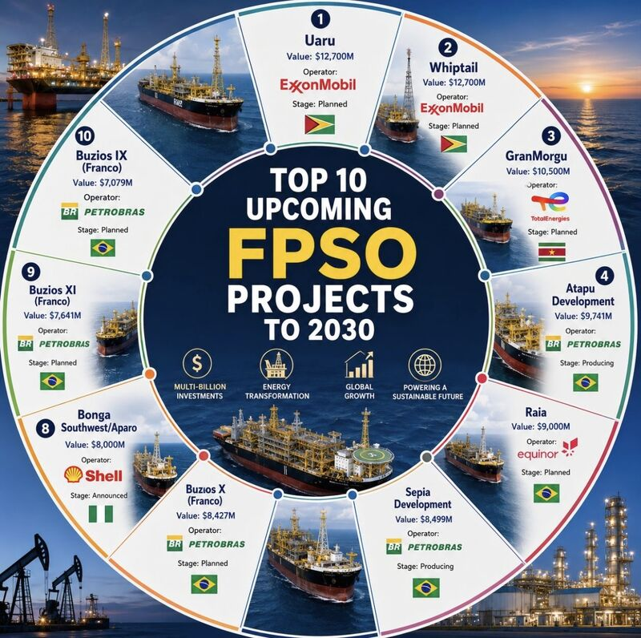

# Top 10 FPSO projects by CAPEX

This case study starts with Giacomo Prandelli's LinkedIn post, [“$94 billion — That's what the top 10 FPSO projects to 2030 are worth”](https://www.linkedin.com/posts/prandelligiacomo_94-billion-thats-what-the-top-10-fpso-activity-7482020247210815488-DdkV). The post and its accompanying top-10 CAPEX visual are the trigger for exploring where the next wave of deepwater investment is concentrated and what that concentration could mean for the offshore supply chain.

## The trigger

The visual makes a striking geographic argument: nine of the ten highest-CAPEX FPSO projects shown are in the South Atlantic. Brazil, Guyana, and Suriname dominate the ranking; Nigeria's Bonga Southwest/Aparo is the only entry outside that region.

The post highlights several features of the ranking:

- The ten projects represent approximately **$94 billion** in combined CAPEX through 2030.
- ExxonMobil's **Uaru** and **Whiptail** projects in Guyana occupy the top two positions, each shown at **$12.7 billion**.
- Petrobras accounts for five entries: **Atapu, Sépia, Búzios X, Búzios XI, and Búzios IX (Franco)**.
- The ranking presents the South Atlantic—especially Brazil's pre-salt and Guyana's Stabroek Block—as the center of near-term large-scale FPSO investment.

## The visual

*The local source visual ranks ten upcoming FPSO projects by stated value, operator, stage, and country.*

The original top-10 FPSO CAPEX visual is included in the [LinkedIn post](https://www.linkedin.com/posts/prandelligiacomo_94-billion-thats-what-the-top-10-fpso-activity-7482020247210815488-DdkV). It ranks the projects by stated capital value and makes the regional concentration immediately visible: the two Guyana projects lead, Petrobras supplies half of the list, and only one project falls outside the South Atlantic grouping.

The visual is useful as a starting point because it turns a collection of individual developments into a portfolio-level signal. The important observation is not only the size of any one FPSO, but the clustering of capital, operators, engineering demand, and long-lived production infrastructure in a small number of offshore basins.

## Questions for the case study

This repository can develop the visual into a traceable industry perspective by asking:

- Which cost definition does each CAPEX estimate use—FPSO contract value, full field development, or another basis?
- What are the project status, expected final investment decision, first-oil date, production capacity, and contracting model?
- How sensitive is the ranking to schedule changes, cost escalation, and project scope?
- Which operators, contractors, yards, and technology suppliers are most exposed to this investment cycle?
- What demand does the concentration create for subsea systems, topsides, mooring, power, automation, connectivity, cybersecurity, reliability, and lifecycle support?

## Source and interpretation

The LinkedIn post and visual are the **trigger source**, not a complete project-cost dataset. Names, rankings, values, and the $94 billion total should be treated as attributed claims until checked against operator disclosures, contract announcements, regulatory filings, and other primary sources. Any derived dataset or updated visual added here should record its source, date, CAPEX definition, currency basis, and confidence level.

### An important question from the discussion

[Luciano Jorge de Carvalho Junior](https://www.linkedin.com/in/luciano-jorge-de-carvalho-junior-349bb530) asked in a comment:

> Those values are including which investments, besides the FPSOs per se?

That question is central to interpreting the ranking. The visual labels the numbers as project values, but does not define their cost boundary. A value could refer to the FPSO contract or vessel scope alone, or it could include drilling, subsea production systems, SURF, installation, host modifications, and other elements of full field development. Comparing values without a common scope can produce a precise-looking but misleading ranking.

The model therefore records the ranking's `capex_scope` as `unknown` and its `capex_scope_status` as `unresolved`. The comment is retained as a `source_comment`, distinctly sourced from the original post and visual, with an open `capex_scope` issue. Until project-level primary sources establish a consistent basis, this case study describes the numbers as **stated project values**, not FPSO-only CAPEX.

### Projects proposed in the discussion

[Jean Carlos Piña](https://www.linkedin.com/in/jean-carlos-pi%C3%B1a-bbaab52b) asked:

> What about Wisting FPSO (Equinor, Barents Sea) and Tangkulo (Yinson, Indonesian Sea)?

The dataset records **Wisting FPSO** and **Tangkulo** as `discussion_project_mention` records with `inclusion_status: suggested_in_comment`. They are deliberately not inserted into the original ranking and have no inferred CAPEX or rank. The comment raises a second methodology question: whether the top ten is globally exhaustive and which schedule, status, and cost-scope rules determine eligibility.

| Project mentioned | Operator stated | Area stated | Dataset status |
| --- | --- | --- | --- |
| Wisting FPSO | Equinor | Barents Sea | Suggested in LinkedIn comment; not reconciled to ranking |
| Tangkulo | Yinson | Indonesian Sea | Suggested in LinkedIn comment; not reconciled to ranking |
| Bay du Nord | Equinor; BW Offshore identified as contractor | Offshore Newfoundland and Labrador | Suggested in LinkedIn comment; described as progressing, but not reconciled to ranking |
| Venus FPSO | TotalEnergies | Offshore Namibia | Suggested in LinkedIn comment; not reconciled to ranking |
| PAJ | Azule Energy identified in a second comment | Offshore Angola | Suggested independently by two commenters; under review, not reconciled to ranking |

[Frode Kristoffersen](https://www.linkedin.com/in/frode-kristoffersen-0aaab52a1) supplied the Bay du Nord observation: “Bay du Nord is also progressing by Equinor and BW Offshore as contractor.” The model keeps BW Offshore in a separate `contractor` entity so its stated role is not incorrectly represented as project operator.

[GOUABI Mohammed Elhabri](https://www.linkedin.com/in/gouabi-mohammed-elhabri-73092028) proposed another omission: “You forget Namibia's Venus FPSO for Total Energies.” Venus is retained as a separately sourced suggestion rather than added to the original top ten.

[Fernando Rueda](https://www.linkedin.com/in/fernando-rueda-b9561853) asked: “Just Brasil? Where is Angola PAJ?” The model retains **PAJ** exactly as supplied, associated with offshore Angola. It leaves the operator and expanded project identity unset pending verification and treats the comment as a challenge to the ranking's geographic completeness.

[Manuel Domingos Ngunza](https://www.linkedin.com/in/manuel-domingos-ngunza-29a265366) independently asked, “Where’s the PAJ Azule Energy,” adding Azule Energy as the stated operator. Both comments remain separate provenance records. The second mention moves PAJ to `under_review`, but independent repetition on LinkedIn is not treated as primary-source verification of its CAPEX or ranking eligibility.
